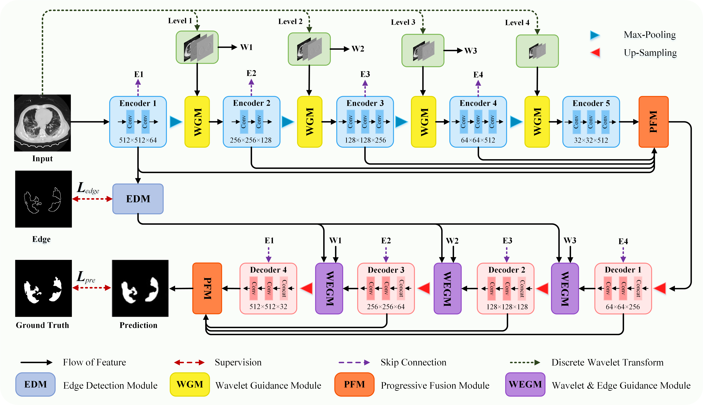

# MWG-Net: Multi-scale Wavelet Guidance Network for COVID-19 Lung Infection Segmentation from CT Images

## Overview

COVID-Seg-100 Dataset
----
This work has approved by ethics review committee of the First Hospital of Changsha  (2022 Ethic [Clinical paper] No.1). We collect 100 COVID-19 CT cases that contain 5870 512 × 512 slices from the First Hospital of Changsha. All confirmed COVID-19 patients underwent multiple CT scans to record the lung lesions at different COVID-19 progressions. The number of slices in the infected area varied in each case (ranging from 42 to 75 slices). The lung window has been adjusted to improve the display of detailed lung tissues, that is, a window width of 1200 Hounsfield Unit (HU) with a window level of -500 HU. The annotation procedure is completed by two clinical radiologists with 10 years of experience. During the annotation for each given image, infected areas are selected as positive (white) pixels on the corresponding binary pixel mask. On average, it takes about 200 ± 20 minutes to delineate one CT scan with 100 slices. This proposed dataset meets the complex and changing clinical requirements and can verify the effectiveness of the segmentation algorithm. For a fair comparison, we randomly select 70 cases for training, 10 cases for validation, and 20 cases for testing. 

This dataset is public, if you want to use it for related research, please contact the email: kaihu@xtu.edu.cn to sign the relevant agreement to obtain.
